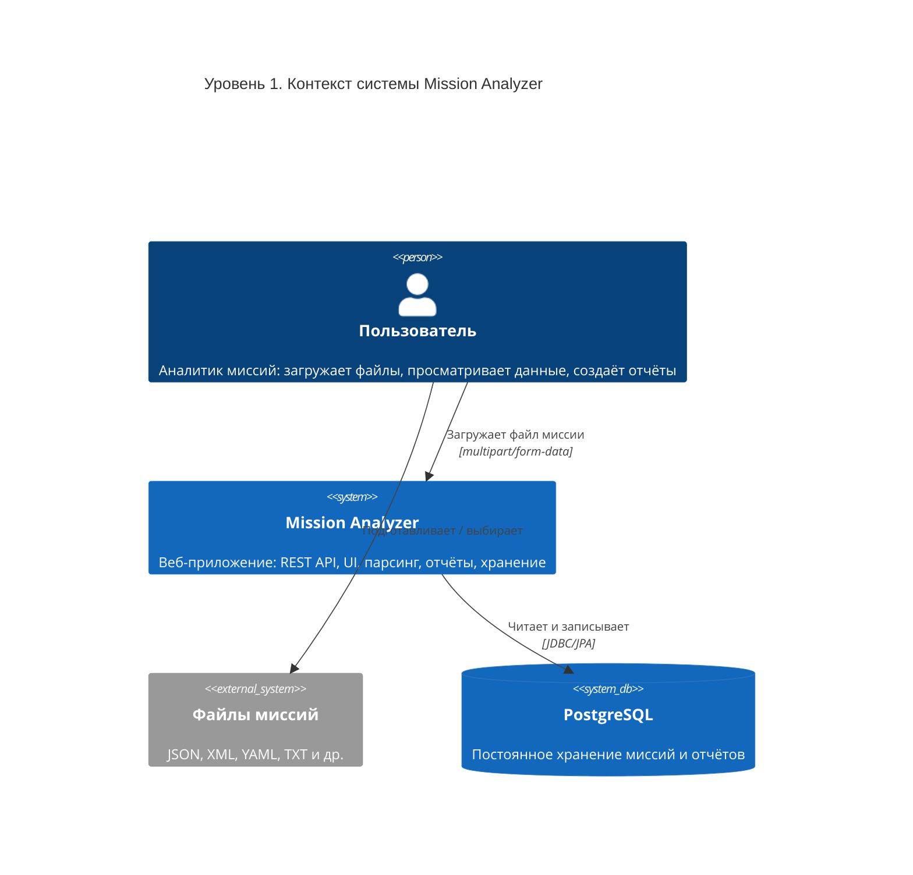
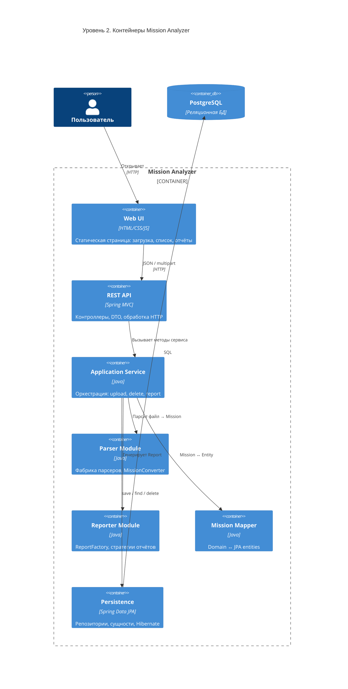
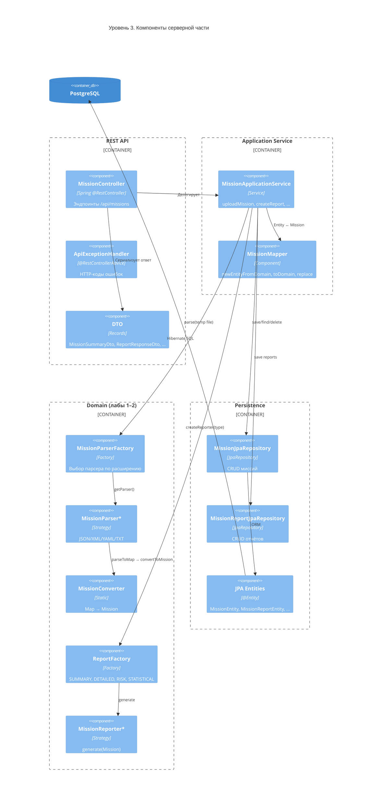
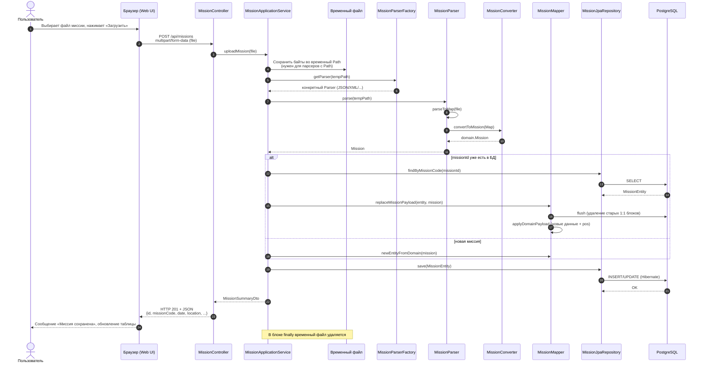
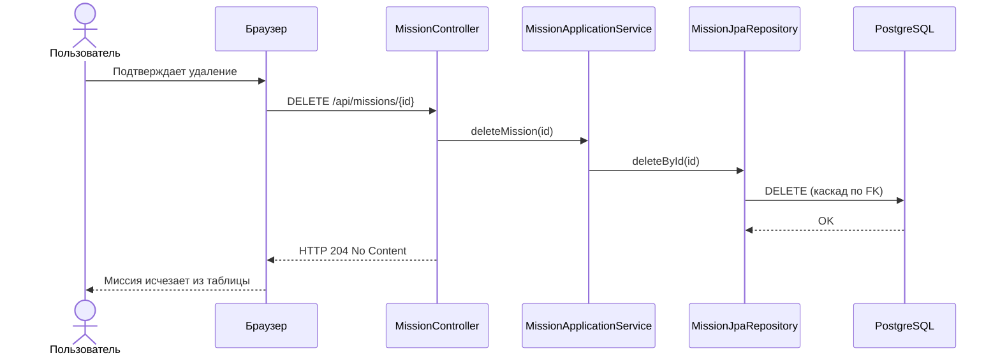

# Лабораторная работа. Веб-приложение Mission Analyzer

## Введение

В предыдущих лабораторных работах был разработан сервис для парсинга миссий и генерации отчётов. Целью данной лабораторной работы было создание веб-приложения для работы с миссиями. Веб-приложение должно реализовать загрузку, удаление миссий, а также генерацию отчётов.

---

## Описание проделанной работы

### Постановка задачи

На основе уже реализованной предметной модели (`domain`), фабрики парсеров (`parser`) и модуля отчётов (`reporter`) требовалось построить полноценное веб-решение, которое:

1. принимает файлы миссий разных форматов (JSON, XML, YAML, TXT и др.);
2. сохраняет разобранные данные в реляционную СУБД PostgreSQL;
3. предоставляет REST API для управления миссиями и отчётами;
4. содержит веб-интерфейс для пользователя;
5. документирует API через Swagger (OpenAPI);
6. сопровождается автоматическими тестами.

### Выполненные работы

#### 1. Переход на архитектуру веб-приложения (Spring Boot)

Создана точка входа `app.MissionWebApplication` — Spring Boot-приложение, которое поднимает встроенный HTTP-сервер (порт по умолчанию 8080), подключается к PostgreSQL и регистрирует REST-контроллеры, сервисы и JPA-репозитории.

Конфигурация вынесена в `src/main/resources/application.yml`:

- параметры подключения к БД (`spring.datasource.*`);
- режим работы JPA: `spring.jpa.hibernate.ddl-auto=update` — Hibernate автоматически создаёт и обновляет таблицы по JPA-сущностям (без отдельных SQL-миграций);
- лимиты загрузки файлов (`spring.servlet.multipart.*`);
- настройки Swagger (`springdoc.*`).

Переменные окружения (`DB_HOST`, `DB_PORT`, `DB_NAME`, `DB_USER`, `DB_PASSWORD`, `SERVER_PORT`) задаются при запуске процесса (в IDE, в shell или через `docker-compose.yml`). В Java/Spring нет обязательного `.env`-файла: в `application.yml` используется синтаксис `${ИМЯ:значение_по_умолчанию}`.

#### 2. Слой REST API

Реализован контроллер `api.MissionController` со следующими операциями:

| Метод | URL | Назначение |
|-------|-----|------------|
| POST | `/api/missions` | Загрузка файла миссии (`multipart/form-data`, поле `file`) |
| GET | `/api/missions` | Список сохранённых миссий (краткая информация) |
| GET | `/api/missions/{id}` | Детальная карточка миссии |
| DELETE | `/api/missions/{id}` | Удаление миссии и связанных данных |
| POST | `/api/missions/{id}/reports` | Создание отчёта по выбранной миссии |
| GET | `/api/missions/{id}/reports` | Список ранее сохранённых отчётов |

Для обмена с клиентом используются DTO (`api.dto.*`), чтобы не отдавать наружу внутренние JPA-сущности. Ошибки обрабатываются централизованно в `api.error.ApiExceptionHandler` (некорректный файл — 400, миссия не найдена — 404 и т.д.).

Интеграция Swagger: библиотека `springdoc-openapi`; UI доступен по адресу `/swagger-ui/index.html`, спецификация — `/api/v3/api-docs`.

#### 3. Слой бизнес-логики (service)

Класс `service.MissionApplicationService` координирует все сценарии:

- **Загрузка миссии:** файл из HTTP сохраняется во временный файл на диске (парсеры исходного проекта работают с `java.nio.file.Path`), выбирается парсер через `MissionParserFactory`, результат преобразуется в `domain.Mission`, затем в JPA-сущности через `MissionMapper` и сохраняется в PostgreSQL. Если миссия с таким `missionId` уже есть — выполняется **обновление** данных (числовой `id` и ранее созданные отчёты сохраняются).
- **Удаление:** удаление записи миссии из БД (каскадно удаляются связанные сущности и отчёты).
- **Генерация отчёта:** миссия загружается из БД, преобразуется обратно в `domain.Mission`, выбирается стратегия отчёта через `ReportFactory` (`SUMMARY`, `DETAILED`, `RISK`, `STATISTICAL`), текст отчёта сохраняется в таблицу `mission_reports` и возвращается клиенту.

`service.MissionMapper` обеспечивает двустороннее преобразование между доменной моделью и сущностями БД, включая вложенные объекты (проклятие, маги, техники, активность врага, экономическая оценка и др.) и порядок элементов в списках (поле `pos`).

#### 4. Слой хранения данных (persistence)

Реализованы JPA-сущности в пакете `persistence.entity`, отражающие структуру домена:

- `MissionEntity` — основная запись миссии;
- связанные таблицы: проклятие, маги, применённые техники, действия врага, таймлайн операции, экономика, гражданские потери, условия окружения, строковые коллекции (теги, рекомендации, заметки и т.д.);
- `MissionReportEntity` — сохранённые сгенерированные отчёты.

Доступ к данным — через Spring Data JPA: `MissionJpaRepository`, `MissionReportJpaRepository`.

PostgreSQL разворачивается через `docker-compose.yml` (контейнер `postgres:16-alpine`, БД `mission_analyzer`).

#### 5. Интеграция с кодом предыдущих лабораторных

Переиспользованы без изменения логики:

- **Парсинг:** `MissionParserFactory`, конкретные парсеры (`JsonMissionParser`, `XmlMissionParser`, `YamlMissionParser`, `TextMissionParser` и др.), `MissionConverter` (словарь → `domain.Mission`).
- **Отчёты:** интерфейс `MissionReporter`, реализации `SummaryReport`, `DetailedReport`, `RiskReport`, `StatisticalReport`, `ReportFactory`.

Таким образом, веб-слой не дублирует предметную логику, а **оборачивает** уже отработанные модули.

#### 6. Веб-интерфейс

В `src/main/resources/static` реализован одностраничный интерфейс (`index.html`, `css/styles.css`, `js/app.js`):

- drag-and-drop и выбор файла для загрузки;
- таблица миссий с обновлением списка;
- просмотр деталей выбранной миссии;
- выбор типа отчёта и генерация;
- просмотр сохранённых отчётов;
- ссылки на Swagger UI.

Клиент обращается к REST API через `fetch` (JSON).

#### 7. Тестирование

Добавлены модульные и интеграционные тесты (JUnit 5, Mockito, MockMvc):

- `MissionMapperTest` — корректность преобразования доменной модели ↔ сущности БД;
- `ReportFactoryTest` — поддержка всех типов отчётов;
- `MissionControllerTest` — HTTP-контракт контроллера.

Запуск: `mvn test`.

#### 8. Документация по запуску

Файл `README.md` описывает требования (JDK 17, Docker, Maven), запуск БД и приложения, переменные окружения, перечень API и структуру пакетов.

### Реализованный функционал (итог)

- загрузка миссии из файла с сохранением в PostgreSQL;
- просмотр списка и деталей миссий;
- удаление миссии;
- генерация отчёта выбранного типа с сохранением в БД;
- просмотр истории отчётов по миссии;
- повторная загрузка файла с тем же `missionId` — обновление данных;
- REST API + Swagger + веб-UI.

### Выводы

В рамках лабораторной работы десктопный/консольный сервис анализа миссий преобразован в клиент–серверное веб-приложение с постоянным хранением данных. Архитектура разделена на слои (API, сервис, persistence, domain/parser/reporter), что упрощает сопровождение и расширение. Использование Spring Boot сократило объём инфраструктурного кода (HTTP, DI, JPA, обработка ошибок), а переиспользование модулей парсинга и отчётов сохранило преемственность с предыдущими лабораторными работами.

---

## Диаграммы

### 1. Архитектурная схема (нотация C4)

#### Уровень 1 — System Context (контекст системы)

Показывает систему в окружении: кто пользуется и с чем она взаимодействует.



#### Уровень 2 — Container (контейнеры)

Показывает крупные части приложения и их связи.



#### Уровень 3 — Component (компоненты backend)

Детализация серверной части при обработке запросов.



---

### 2. Диаграмма последовательности — загрузка миссии

Сценарий: пользователь загружает файл миссии через веб-интерфейс (`POST /api/missions`).



**Что возвращается клиенту:** JSON с кратким описанием сохранённой миссии (`MissionSummaryDto`: числовой `id`, код миссии, дата, локация, исход, имя исходного файла). Текст отчёта на этом этапе **не** генерируется.

---

### 3. Диаграмма последовательности — генерация отчёта

Сценарий: пользователь выбирает миссию в таблице и создаёт отчёт (`POST /api/missions/{id}/reports`).

```mermaid
sequenceDiagram
    autonumber
    actor User as Пользователь
    participant Browser as Браузер (Web UI)
    participant Ctrl as MissionController
    participant Svc as MissionApplicationService
    participant MRepo as MissionJpaRepository
    participant Map as MissionMapper
    participant DB as PostgreSQL
    participant RF as ReportFactory
    participant Rep as MissionReporter<br/>(Summary/Detailed/...)
    participant RRepo as MissionReportJpaRepository

    User->>Browser: Выбирает миссию, тип отчёта, «Сгенерировать»
    Browser->>Ctrl: POST /api/missions/{id}/reports<br/>JSON {"reportType":"SUMMARY"}

    Ctrl->>Svc: createReport(missionId, reportType)

    Svc->>MRepo: findById(missionId)
    MRepo->>DB: SELECT mission + связанные сущности
    DB-->>MRepo: MissionEntity
    MRepo-->>Svc: MissionEntity

    Svc->>Map: toDomain(MissionEntity)
    Map-->>Svc: domain.Mission

    Note over Svc,Rep: Этап генерации документа (текстового отчёта)

    Svc->>RF: createReporter(reportType)
    RF-->>Svc: MissionReporter
    Svc->>Rep: generate(Mission)
    Rep-->>Svc: Report (content, type)

    Svc->>RRepo: save(MissionReportEntity)
    RRepo->>DB: INSERT INTO mission_reports
    DB-->>RRepo: id отчёта

    Svc-->>Ctrl: ReportResponseDto
    Ctrl-->>Browser: HTTP 201 + JSON<br/>{id, missionId, reportType, content, createdAt}
    Browser-->>User: Отображение текста отчёта на странице

    Note over Browser,User: Клиент получает готовый текст отчёта в поле content;<br/>копия сохранена в БД для истории (GET /reports)
```

**Где происходит генерация документа:** на шагах 9–11 — после восстановления `domain.Mission` из БД, в модуле `reporter` (стратегия выбирается `ReportFactory`). Результат — объект `Report` с текстовым полем `content`.

**Что возвращается клиенту:** JSON `ReportResponseDto` с полным текстом отчёта, типом (`SUMMARY`, `DETAILED`, …), идентификатором записи и временем создания.

---

### 4. Диаграмма последовательности — удаление миссии (кратко)



---

## Используемые технологии

| Технология | Назначение в проекте |
|------------|----------------------|
| Java 17 | Язык реализации |
| Maven | Сборка, зависимости, тесты |
| Spring Boot 3.2 | Веб-сервер, DI, конфигурация |
| Spring Web MVC | REST API |
| Spring Data JPA / Hibernate | ORM, работа с PostgreSQL |
| PostgreSQL 16 | Хранение миссий и отчётов |
| Jackson, SnakeYAML | Парсинг JSON/YAML (в парсерах) |
| springdoc-openapi | Swagger UI |
| JUnit 5, Mockito, MockMvc | Тестирование |
| Docker Compose | Локальный запуск БД |

---

## Структура исходного кода (краткий справочник)

```
src/main/java/
├── app/              — MissionWebApplication (старт), старый GUI (MainFrame)
├── api/              — REST-контроллер, DTO, обработчик ошибок
├── service/          — MissionApplicationService, MissionMapper
├── persistence/      — JPA entity + repository
├── domain/           — предметная модель Mission и связанные типы
├── parser/           — парсеры файлов, MissionConverter
├── reporter/         — генерация отчётов
├── facade/           — фасад для десктоп-режима (лаб. 1–2)
├── enums/            — перечисления (ReportType, ThreatLevel, ...)
└── config/           — Swagger, CORS, Spring-бины фабрик

src/main/resources/
├── application.yml   — настройки Spring и БД
└── static/           — веб-интерфейс (index.html, css, js)
```
